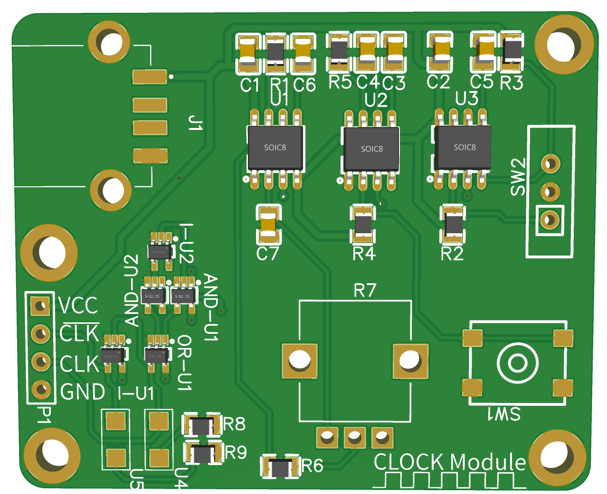

## Clock Module

Clock module whit adjustable-speed and a manual mode able to advance each clock cycle.

Parts | Quantities
------------ | -------------
0805 0.01uF | 3
0805 1uF | 1
0805 0.1uF | 3
1206 SMD LED | 2
Header-Female-2.54_1x4 | 1
SN74LVC1G32DCKR | 1
SN74LVC1G04DCKR | 2
87583-3010RPALF | 1
B3FS-1010P | 1
EG1218 | 1
0805 1k Ω | 6
0805 220 Ω | 2
LM555CMX| 3
Potentiometer 10K | 1
SN74LVC1G08DCKR | 2

 Happy Hacking! 💻
